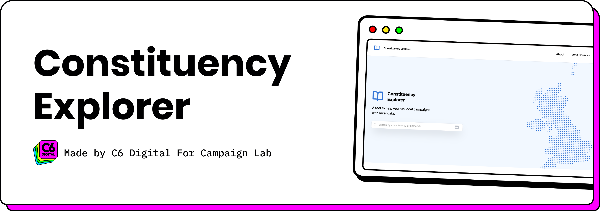

# Constituency Explorer

An app for people to explore the new UK constituency boundaries.

Data can be mapped to the new constituencies via a few different methods:

- [Mapped by Common Knowledge](https://mapped.commonknowledge.coop/)
- [MySociety Postcode Converter](https://pages.mysociety.org/2025-constituencies/postcode-converter)
- [MySociety postcodes](https://pages.mysociety.org/2025-constituencies/datasets/uk_parliament_2025_postcode_lookup/latest)
- [ONS postcodes](https://geoportal.statistics.gov.uk/datasets/a8a2d8d31db84ceea45b261bb7756771/about)
- [ONS Postcode to Westminster Parliamentary Constituencies](https://geoportal.statistics.gov.uk/search?q=postcode%20to%20constituency)

## Datasets

| Dataset | Fixture file | Source | Fields | Import command |
|---------|--------------|--------|--------|----------------|
| New (post-July 2024) constituencies | [GitHub](https://github.com/CampaignLab/constituency-explorer/blob/refs/heads/main/database/fixtures/parliament_con_2025.csv) ([raw](https://raw.githubusercontent.com/CampaignLab/constituency-explorer/refs/heads/main/database/fixtures/parliament_con_2025.csv)) | [Source](https://geoportal.statistics.gov.uk/datasets/9a876e4777bc47e392e670a7b8bc3f5c_0/explore) |  | `import:constituencies` |
| Constituency populations | [GitHub](https://github.com/CampaignLab/constituency-explorer/blob/refs/heads/main/database/fixtures/constituencies_population.csv) ([raw](https://raw.githubusercontent.com/CampaignLab/constituency-explorer/refs/heads/main/database/fixtures/constituencies_population.csv)) | [Source](https://check.justregister.org.uk/) |  | `import:constituencies-population` |
| Constituency shapefiles | [GitHub](https://github.com/CampaignLab/constituency-explorer/blob/refs/heads/main/database/fixtures/pcon24.geojson) ([raw](https://raw.githubusercontent.com/CampaignLab/constituency-explorer/refs/heads/main/database/fixtures/pcon24.geojson)) | - |  | `import:constituency-geojson` |
| Parliament constituency IDs | - | [Source](https://members-api.parliament.uk/index.html) |  | `import:parliament-constituency-ids` |
| Old (pre-July 2024) constituencies | [GitHub](https://github.com/CampaignLab/constituency-explorer/blob/main/database/fixtures/Westminster_Parliamentary_Constituencies_(December_2023)_Names_and_Codes_in_the_UK.csv) ([raw](https://raw.githubusercontent.com/CampaignLab/constituency-explorer/main/database/fixtures/Westminster_Parliamentary_Constituencies_(December_2023)_Names_and_Codes_in_the_UK.csv)) | [Source](https://geoportal.statistics.gov.uk/datasets/b2498c2781134c87a7d7648045ed3252_0/explore) | Name, GSS code | `import:old-constituencies` |
| Old constituency overlaps | [GitHub](https://github.com/CampaignLab/constituency-explorer/blob/main/database/fixtures/PARL10_PARL25_combo_overlap.csv) ([raw](https://raw.githubusercontent.com/CampaignLab/constituency-explorer/main/database/fixtures/PARL10_PARL25_combo_overlap.csv)) | [Source](https://pages.mysociety.org/2025-constituencies/datasets/geographic_overlaps/latest) |  | `import:old-constituency-overlaps` |
| Local Authorities Districts | [GitHub](https://github.com/CampaignLab/constituency-explorer/blob/main/database/fixtures/local_authority_districts.csv) ([raw](https://raw.githubusercontent.com/CampaignLab/constituency-explorer/main/database/fixtures/local_authority_districts.csv)) | [Source](https://geoportal.statistics.gov.uk/datasets/e8b361ba9e98418ba8ff2f892d00c352_0/explore) |  | `import:local-authorities` |
| Constituency -> Local authority mappings | [GitHub](https://github.com/CampaignLab/constituency-explorer/blob/main/database/fixtures/overlap_local_authorities_cons_2025.csv) ([raw](https://raw.githubusercontent.com/CampaignLab/constituency-explorer/main/database/fixtures/overlap_local_authorities_cons_2025.csv)) | [Source](https://pages.mysociety.org/2025-constituencies/datasets/geographic_overlaps/latest) |  | `import:constituency-local-authority-pivot-data` |
| Charities | [GitHub](https://github.com/CampaignLab/constituency-explorer/blob/refs/heads/main/database/fixtures/CharityBase_6a177e34883233ee698fa2b9a69a34d4.csv) ([raw](https://raw.githubusercontent.com/CampaignLab/constituency-explorer/refs/heads/main/database/fixtures/CharityBase_6a177e34883233ee698fa2b9a69a34d4.csv)) | [Source](https://search.charitybase.uk/chc?download=f) | Charity ID, Name, Registered, Financial Year, Address, Constituency ID | `import:charities` |
| Towns | [GitHub](https://github.com/CampaignLab/constituency-explorer/blob/main/database/fixtures/uktowns.csv) ([raw](https://raw.githubusercontent.com/CampaignLab/constituency-explorer/main/database/fixtures/uktowns.csv)) | [Source](https://drive.google.com/file/d/1AeRnZSxRrVxPBSLeF3QQScrdRZ8GJhkl/view) |  | `import:towns` |
| Constituency town mappings | [GitHub](https://github.com/CampaignLab/constituency-explorer/blob/refs/heads/main/database/fixtures/towns-map.csv) ([raw](https://raw.githubusercontent.com/CampaignLab/constituency-explorer/refs/heads/main/database/fixtures/towns-map.csv)) | - | Constituency name, Town name | `import:constituency-town-mappings` |
| Dentists (England) | [GitHub](https://github.com/CampaignLab/constituency-explorer/blob/refs/heads/main/database/fixtures/dentists-england.csv) ([raw](https://raw.githubusercontent.com/CampaignLab/constituency-explorer/refs/heads/main/database/fixtures/dentists-england.csv)) | [Source](https://github.com/CampaignLab/New-Constituency-Almanac/blob/main/data/dentists%20england%20mapped.csv) | Name, Address, Postcode, Latitude, Longitude, Constituency ID | `import:dentists` |
| Hospitals (England) | [GitHub](https://github.com/CampaignLab/constituency-explorer/blob/refs/heads/main/database/fixtures/hospitals-england.csv) ([raw](https://raw.githubusercontent.com/CampaignLab/constituency-explorer/refs/heads/main/database/fixtures/hospitals-england.csv)) | [Source](https://github.com/CampaignLab/New-Constituency-Almanac/blob/main/data/english%20hospitals%20by%20constituency.csv) | Name, Address, Postcode, Latitude, Longitude, Constituency ID | `import:english-hospitals` |
| Hospitals (Scotland) | [GitHub](https://github.com/CampaignLab/constituency-explorer/blob/refs/heads/main/database/fixtures/hospitals-scotland.csv) ([raw](https://raw.githubusercontent.com/CampaignLab/constituency-explorer/refs/heads/main/database/fixtures/hospitals-scotland.csv)) | [Source](https://github.com/CampaignLab/New-Constituency-Almanac/blob/main/data/hospitals%20in%20scotland%20by%20constituency.csv) | Name, Address, Postcode, Latitude, Longitude, Constituency ID | `import:scottish-hospitals` |
| Schools (England) | [GitHub](https://github.com/CampaignLab/constituency-explorer/blob/refs/heads/main/database/fixtures/schools-england.csv) ([raw](https://raw.githubusercontent.com/CampaignLab/constituency-explorer/refs/heads/main/database/fixtures/schools-england.csv)) | [Source](https://get-information-schools.service.gov.uk/Downloads) | Name, Phase of education, Gender, Latitude, Longitude, Constituency ID | `import:english-schools` |
| Schools (Scotland) | [GitHub](https://github.com/CampaignLab/constituency-explorer/blob/refs/heads/main/database/fixtures/schools-scotland.xlsx) ([raw](https://raw.githubusercontent.com/CampaignLab/constituency-explorer/refs/heads/main/database/fixtures/schools-scotland.xlsx)) | [Source](https://www.data.gov.uk/dataset/9a6f9d86-9698-4a5d-a2c8-89f3b212c52c/scottish-school-roll-and-locations) | Name, Phase of education, Latitude, Longitude, Constituency ID | `import:scottish-schools` |
| Community centres | [GitHub](https://github.com/CampaignLab/constituency-explorer/blob/refs/heads/main/database/fixtures/community-centres.csv) ([raw](https://raw.githubusercontent.com/CampaignLab/constituency-explorer/refs/heads/main/database/fixtures/community-centres.csv)) | - | Name, Religion, Denomination, Postcode, Latitude, Longitude, Constituency ID | `import:community-centres` |
| Places of worship | [GitHub](https://github.com/CampaignLab/constituency-explorer/blob/refs/heads/main/database/fixtures/places-of-worship.csv) ([raw](https://raw.githubusercontent.com/CampaignLab/constituency-explorer/refs/heads/main/database/fixtures/places-of-worship.csv)) | - | Name, Religion, Denomination, Postcode, Latitude, Longitude, Constituency ID | `import:places-of-worship` |
| Green spaces | [GitHub](https://github.com/CampaignLab/constituency-explorer/blob/refs/heads/main/database/fixtures/green-spaces.csv) ([raw](https://raw.githubusercontent.com/CampaignLab/constituency-explorer/refs/heads/main/database/fixtures/green-spaces.csv)) | - | Name, Opening hours, Postcode, Latitude, Longitude, Constituency ID | `import:green-spaces` |
| Local media | [GitHub](https://github.com/CampaignLab/constituency-explorer/blob/refs/heads/main/database/fixtures/local-media.csv) ([raw](https://raw.githubusercontent.com/CampaignLab/constituency-explorer/refs/heads/main/database/fixtures/local-media.csv)) | - | Name, Address, Twitter, Type of owner, Frequency, Cost, Media Type, Website, Local Authority ID, Constituency ID | `import:local-media` |

## Installation

1. Clone repository.
2. Install dependencies.

```sh
npm ci
composer install
```

3. Create `.env`

```sh
cp .env.example .env
```

4. Generate app key

```sh
php artisan key:generate
```

5. Run migrations

```sh
php artisan migrate
```

### Import data

On a fresh installation, you can use the following command to import all datasets at once.

```sh
php artisan import:data
```

If you wish to import datasets separately, e.g. after pulling, use the following commands:

```sh
php artisan import:constituencies
php artisan import:constituencies-population
php artisan import:constituency-geojson
php artisan import:parliament-constituency-ids
php artisan import:old-constituencies
php artisan import:old-constituency-overlaps
php artisan import:local-authorities
php artisan import:constituency-local-authority-pivot-data
php artisan import:charities
php artisan import:towns
php artisan import:constituency-town-mappings
php artisan import:dentists
php artisan import:english-hospitals
php artisan import:scottish-hospitals
php artisan import:english-schools
php artisan import:scottish-schools
php artisan import:community-centres
php artisan import:places-of-worship
php artisan import:green-spaces
php artisan import:local-media
```

### Assets

```sh
npm run dev   # Local development build, runs a watcher
npm run build # Production build, commit to Git
```
